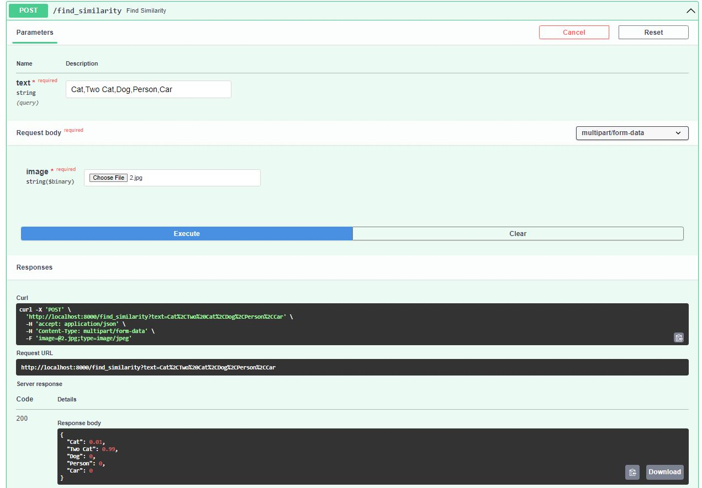
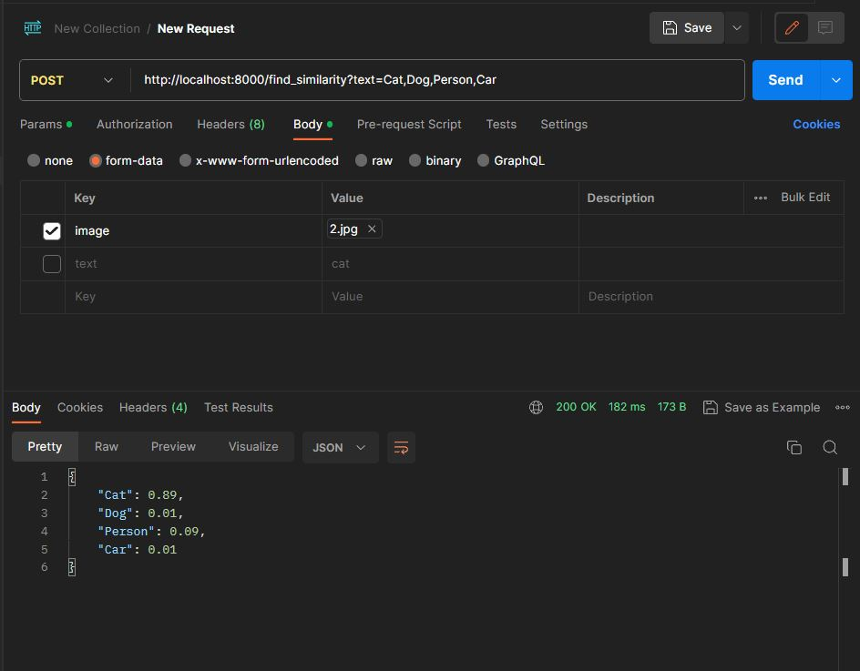
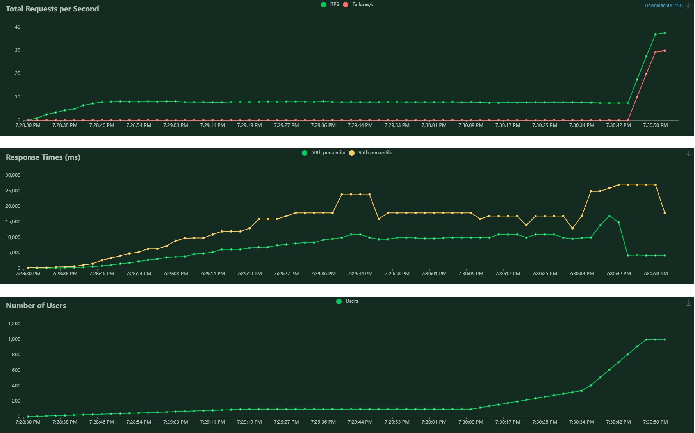

# Assignment 11: Fast API Implementation using Docker
- Take the CLIP Model from Huggingface (same as this session) and Write FastAPI APIs for Image and List of Texts similarity.
- For Example Image of Cat and List of texts like: a cat, a dog, a catterpillar, a hotdog, etc. Return the text similarity scores (probs) for each of the text
- The return dict from API should be like: {"a cat": 0.34, "a dog": 0.10, ...}
- Deploy on ECS with Load Balancer 5 replicas on ECS (4cpu, 8gb ram each Container)
- Perform Locus Stress test
- Test with Postman
- Test with FastAPI Docs
- Connect the deployed API to the FrontEnd, Invoking Model from Frontend

# Approach: 
1. Using the hugging face library "Transformers" Downloaded the clip model. 
2. Provided the clip processer the text and image inputs which returns the embedding and using the model and softmax get the probability for each text description
3. Using the fastapi, created the api call for the model with image and texts as input and text probabilities as output.
3. Deployed the fastapi code "Server.py" file in the docker container.  
4. Used the postman, fastapi swagger and locust test to check the api performance. 
5. Created the AWS EC2 instance and deployed the docker images to ECR
6. Using the ECS cluster task and service, created multiple replics of the api server
7. Test the performance of AWS using locus test.
8. Created the front end using node js.

## Swagger


## Postman


## Locust on Local


## Locust on AWS


## AWS Load balancer


## Node.js Front end

# Steps for Execution:
1. Build the docker image (fast_api) using below command.
```
docker build -t clip .
```
2. Run the docker container using the below command.
```
docker run -it -p 80:80 clip
```

3. Run the locust server.
```
locust -f locust_test.py
```


# Group Members:
- Anurag Mittal
- Aman Jaipuria